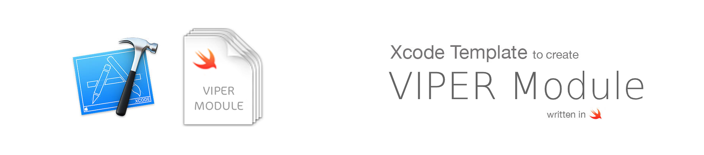
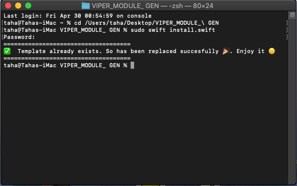

When you decide to use `VIPER` architecture in your project, it is very tired create new modules, because you need create at least 5 files for each. Imagine that you need to create 6 modules, I was suffering this problem, and this is the reason why I searched for XCode Template to save my time. 

I found a lot of templates and module generators, But some of them was complicated, Other was without `NavigationController` which I prefer in Navigation between modules, So I decided to modify existed module generator to fit my needs.

It's very useful for me and I hope that for you too.


## How to install

### Using script (easy)
Only need execute this command in terminal:
```swift
sudo swift install.swift
```
You should be this output message:



If all it's ok you now could find your template in Xcode.

### Manual
Go to Application folder, browse to the Xcode application icon. Right-click it and choose 'Show Package Contents'. Then browse to:
`Contents/Developer/Platforms/iPhoneOS.platform/Developer/Library/Xcode/Templates/Project Templates/iOS/Application` and add "VIPERModule.xctemplate" file. Now you can find your template in Xcode.

## Easy to use


## VIPER diagram overview


## Generated files
This template generates all files that you need to create a new VIPER module. All generated code is Swift 5.

| File Name | Acts As | Description |
| :---         |     :---      |          :--- |
| `_ModuleName_Protocols.swift`   | Contract     | This is where all your VIPER protocols should be defined  |
| `_ModuleName_Model.swift`   | Entity     | This is the Entity, It's should be a String respresntation of your Model  |
| `_ModuleName_ViewController.swift`    | View   |  This is where are IBActions and Outlets should be connected and call the presenter  |
| `_ModuleName_ViewController+Delegates.swift`    | Presenter to View     | Here we implement the methods that presenter use to cammunicate with the view   |
| `_ModuleName_Presenter.swift`    | Presenter |    This is what will communicate with the View, Interactor and Router   |
| `_ModuleName_Interactor.swift`    | Interactor  | This is what will communicate with the Data Layer and Entity   |
| `_ModuleName_Router.swift`    | Router     | This is where your routes to another views should be     |
| `_ModuleName_ViewController.xib`    | UIView     | This is where your design layout should be    |

## Generated code
This template generates all files that you need to create a new VIPER module. All generated code is `Swift 5`.

This is an example, we're creating a `Login` module:

- [Login module](/assets/default.md)

#### Main Router
This is the Main Router of the application (`AppCoordinator`) 

| File Name | Acts As | Description |
| :---         |     :---      |          :--- |
| `MainRouter.swift`   | AppCoordinator     | This is the Main Router of the application   |

#### Routing 

- In `AppDelegate` and `SceneDelegate`
If you want to start with specific Module (ViewController) in AppDelegate or SceneDelegate

1- Change the following code in `MainRouter` with your initial View Controller

```swift
// Change with your initial view controller
let loginView = LoginRouter.createModule()
navigationController = UINavigationController(rootViewController: loginView)
```

2- In `AppDelegate` File, Define a `UIWindow` and `MainRouter`

```swift
var window: UIWindow?
var mainRouter: MainRouter?
```

3- In `didFinishedWithOptions` method, Your code will be like this 

```swift
func application(_ application: UIApplication, didFinishLaunchingWithOptions launchOptions: [UIApplication.LaunchOptionsKey: Any]?) -> Bool {

    window = UIWindow()
    mainRouter = MainRouter(window: window!)
    mainRouter?.start()

    return true

}
```

4- In `SceneDelegate` File, Define a `UIWindow` and `MainRouter`

```swift
var window: UIWindow?
var mainRouter: MainRouter?
```

5- In `willConnectTo` method, Your code will be like this 

```swift
func scene(_ scene: UIScene, willConnectTo session: UISceneSession, options connectionOptions: UIScene.ConnectionOptions) {

    guard let scene = (scene as? UIWindowScene) else { return }
    window = UIWindow(windowScene: scene)
    mainRouter = MainRouter(window: window!)
    mainRouter?.start()

}
```

- Navigate From Module to another 
If you are in specific module and want to navigate to another module

Assuming that you have `LoginModule` and `HomeModule`

In `LoginProtocols` file, You defined the following method in `LoginRouterProtocol`
```swift
func navigateToHome() 
```

In `LoginRouter` file, you will implement the `navigateToHome` method with the following code:

```swift 
func navigateToHome() { 
    let homeView = HomeRouter.createModule()
    viewController?.navigationController.pushViewController(homeView, animated: true)
}
```

## Why VIPER?
After using VIPER, I've found it to be very beneficial in many ways. Let’s get back to the list of things we set out to accomplish when architecting our app to see if VIPER addresses them.

- Single responsibility principles applied.
- Easy to iterate on.
- Collaboration friendly.
- Separated out concerns.
- Spec-ability.
- Testability. 

## VIPER Checklist
To get started easier, we’ve prepared a list of notes to make sure everything follows the VIPER’s design principle. We hope this will be useful to you also as we find it to be.

* [ ] Views and view controllers receive user interactions and pass them to presenters for decision making.
* [ ] Presenters contain the view logics and prepare content for display and reacting to user inputs.
* [ ] Presenters should not know about the existence of all UIViews.
* [ ] Interactors contain business logics and they should be independent of UI.
* [ ] Models are  model objects manipulated by Interactors.
* [ ] Router is the only place to define screen navigations and their transition animations.
* [ ] Protocols contains all my functions that I'll use for the project.

----

## References
- [iOS Architecture Patterns](https://medium.com/ios-os-x-development/ios-architecture-patterns-ecba4c38de52#.ba7q8dcih)
- [#8 VIPER to be or not to be?](https://swifting.io/blog/2016/03/07/8-viper-to-be-or-not-to-be/)
- [https://www.objc.io/issues/13-architecture/viper/](https://www.objc.io/issues/13-architecture/viper/)
- [https://www.ckl.io/blog/ios-project-architecture-using-viper/](https://www.ckl.io/blog/ios-project-architecture-using-viper/)

- [Juanpe/Swift-VIPER-Module](https://github.com/Juanpe/Swift-VIPER-Module)
- [Kaakati/VIPER-Module-Generator](https://github.com/Kaakati/VIPER-Module-Generator)

## Contributed
This is an open source project, so feel free to contribute.
- Open an [issue](https://github.com/TahaMahmoud/VIPER-Module-Generator/issues/new).

## Authors:
Created by 
- Taha Mahmoud [LinkedIn](https://www.linkedin.com/in/engtahamahmoud/)
- Ahmed Ramzy [LinkedIn](https://www.linkedin.com/in/iramzy/)

Please don't hesitate to ask any clarifying questions about the project if you have any.